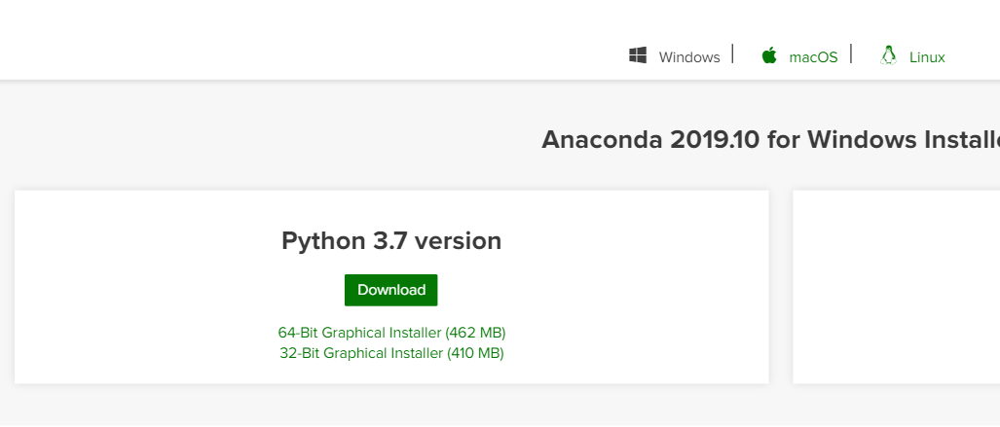

# BERT-as-service Installation Instruction

This introduction shows one of the most painless way to install and play with
BERT. 

> We will use the serivce program created by [hanxiao](https://github.com/hanxiao/bert-as-service), which maps a variable-length sentence to a fixed-length vector using BERT model. For more details, please refer to [https://bert-as-service.readthedocs.io](https://bert-as-service.readthedocs.io)

## Installing Platform

We will run our code on Python ($\geq 3.5$) with Tensorflow ($\geq 1.10$). To
reduce the difficulties of resovling dependencies and install requirements, we
will use a popular data science platform [Anaconda](https://www.anaconda.com/).

### 1. Download Anaconda 3

Go to the website https://www.anaconda.com/distribution/#download-section, and
select the version that suits your system. **Note: we should download Python3.7
Version**. 



For Windows system, you will get an `.exe` file. Double-click, and install it.

For Unix system, we can also use `wget` to download the package directly by

```bash
wget https://repo.anaconda.com/archive/Anaconda3-2019.10-Linux-x86_64.sh
```

### 2. Installing Anaconda 3

The installation is almost automatic. You need to guarantee that you have full
permission to the directory that you install Anaconda. Make sure Anaconda3 is
added to your environment path.

#### Tiny Hints

- Always select a proper version.
- Use a customized home directory that you have full control of when installing.
- Make sure Anaconda3 is added to your environment path.
- Search your problem in Google or Stackoverflow first.

## Installing Tensorflow

**Note: for Windows system, the following commands can be executed in Powershell**

Anaconda provides a convenient package manager that can automatically resolve and install system-level dependencies in an isolated environment. 

We recommend you to install Tensorflow on a new virtual environment. See https://www.tensorflow.org/install/pip#2.-create-a-virtual-environment-recommended

Create a new virtual environment by choosing a Python interpreter and making a 
`./venv` directory to hold it:

```bash
conda create -n venv pip python=3.7  # select python version
```

Activate the virtual environment:

```bash
conda activate venv
```

Within the virtual environment, install the TensorFlow pip package (cpu-only, py3.7)
**Do not install Tensorflow 2.0. It is not supported yet.**

```bash
pip install tensorflow==1.14
```

### Verify your installation

```python
python -c "import tensorflow as tf;print(tf.reduce_sum(tf.random.normal([1000, 1000])))"
```

If no error is reported, your isntallation is successful.

If you want to leave your virtual environment, you can type

```bash
conda deactivate
```

## Installing Bert-as-Service

The installation is very simple by:

```bash
pip install bert-serving-server  # server
pip install bert-serving-client  # client, independent of `bert-serving-server`
```

You may also refer to https://github.com/hanxiao/bert-as-service#install

### Use Pretrained Models

In this project, you are required to use `BERT-small-uncased` pretrained model, [link](https://storage.googleapis.com/bert_models/2018_10_18/uncased_L-12_H-768_A-12.zip). For fun, you may also download other pretrained models from [here](https://github.com/hanxiao/bert-as-service#1-download-a-pre-trained-bert-model).

Download the pretrained model and unzip it to a directory, e.g. `./uncased_L-12_H-768_A-12`

## Almost Done!

### Run a simple test

First, start the server by  *(you should set `-num_worker=1`, unless you have installed a GPU version of TF and have more GPUs*).

```bash
bert-serving-start -model_dir ./uncased_L-12_H-768_A-12/ -num_worker=1 -cpu -pooling_strategy=NONE -show_tokens_to_client
```

And open `python` in another terminal

```python
from bert_serving.client import BertClient
import numpy as np

def mean_pooling(input):
    cnt = np.sum(input!=0, axis=1)
    return np.sum(input, axis=1) / cnt 

bc = BertClient()
mean_pooling(bc.encode(['What a nice day', 'everyone gets an A'])) 
# we manully do the mean pooling, by using np.mean()
```

Ideally, the output is
```python
array([[-0.01555783, -0.2325154 ,  0.17880076, ..., -0.16294773,
         0.095397  , -0.09102419],
       [-0.25249135,  0.1036251 , -0.08484149, ..., -0.14833212,
         0.8393693 ,  0.509507  ]])
```

That's identical to the BERT-AS-SERVICE default mean pooling output:
```python
array([[-0.01555783, -0.2325154 ,  0.17880076, ..., -0.16294773,
         0.095397  , -0.09102419],
       [-0.25249135,  0.1036251 , -0.08484149, ..., -0.14833212,
         0.8393693 ,  0.509507  ]], dtype=float32)
```