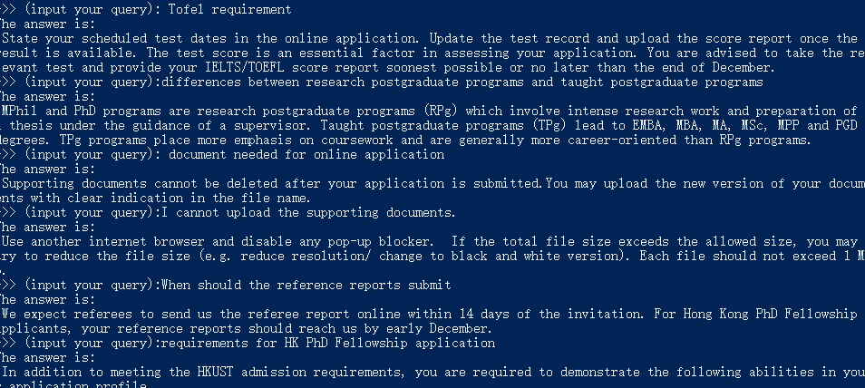

# A simple application: HKUST PG Admission FAQ Semantic Search

This example aims to give you quick understanding of how to use BERT-as-Service 
for your task. You can find more cases [here](https://github.com/hanxiao/bert-as-service/tree/master/example). 

In this example, we will build a semantic retrival-based QA system about HKUST
CSE PG admission. 

First, you can download the corpus from [here](samples.txt). Suppose the server 
has been correctly started. 

## Corpus Pre-processing

```python
with open("samples.txt", encoding="utf8") as f:
    lines = [line.strip() for line in f]
qa_pairs = [line.split('|||') for line in lines]
```

## Setup Bert-serving Client

```python
from bert_serving.client import BertClient
bc = BertClient() # on your computer 
# bc = BertClient(ip="lgpu1", port=10086, port_out=10087) # on CSD computer
```

## Encode Keys

```python
keys = [qa[0] for qa in qa_pairs]
key_vecs = bc.encode(keys)[:,0,:] # take [CLS] to represent the whole sentence```

## Define Search Function

```python
def search_vec(query):
    def distance(a, b):
        import numpy as np
        return np.linalg.norm(a-b)
    q_v = bc.encode(query)[:,0,:]
    min_idx = -1
    min_dis = 1e100
    for i, k_v in enumerate(key_vecs):
        dist = distance(q_v, k_v)
        if dist < min_dis:
            min_dis = dist
            min_idx = i
    return qa_pairs[min_idx][1]
```

## Search

```python
while True:
    query = input(">>> (input your query):")
    print("The answer is:\n" + search_vec([query]))
```


## Testing


```
>>> (input your query): Tofel requirement
The answer is:
  State your scheduled test dates in the online application. Update the test record
   and upload the score report once the result is available. The test score is an
   essential factor in assessing your application. You are advised to take the 
   relevant test and provide your IELTS/TOEFL score report soonest possible or 
   no later than the end of December.
>>> (input your query):differences between research postgraduate programs and 
taught postgraduate programs
The answer is:
    MPhil and PhD programs are research postgraduate programs (RPg) which involve 
    intense research work and preparation of a thesis under the guidance of a 
    supervisor. Taught postgraduate programs (TPg) lead to EMBA, MBA, MA, MSc, MPP 
    and PGD degrees. TPg programs place more emphasis on coursework and are 
    generally more career-oriented than RPg programs.
>>> (input your query): document needed for online application
The answer is:
    Supporting documents cannot be deleted after your application is submitted.You 
    may upload the new version of your documents with clear indication in the file 
    name.
>>> (input your query):I cannot upload the supporting documents.
The answer is:
    Use another internet browser and disable any pop-up blocker.  If the total file
    size exceeds the allowed size, you may try to reduce the file size (e.g. 
    reduce resolution/ change to black and white version). Each file should not 
    exceed 1 MB.
>>> (input your query):When should the reference reports submit
The answer is:
    We expect referees to send us the referee report online within 14 days of the 
    invitation. For Hong Kong PhD Fellowship applicants, your reference reports 
    should reach us by early December.
>>> (input your query):requirements for HK PhD Fellowship application
The answer is:
    In addition to meeting the HKUST admission requirements, you are required to 
    demonstrate the following abilities in your application profile.
```